# 🍋 Lemoncode Challenge - Mi solución (Node Stack)

Aquí dejo cómo he resuelto los 4 retos del laboratorio final, usando el stack de Node.js (`backend/` + `frontend/`, copiados de `node-stack` y montados en esta carpeta aparte para la entrega).

---

## 📦 Reto 1: MongoDB en Contenedor

### Crear la red Docker

```bash
docker network create lemoncode-challenge
```

### Levantar MongoDB

```bash
docker run -d --network lemoncode-challenge --name mongo_challenge \
  -v mongo-data:/data/db \
  mongo:7.0
```

Un par de cosas que decidí aquí:
- Uso la red `lemoncode-challenge` para que el contenedor se pueda localizar por su nombre (`mongo_challenge`) desde los demás.
- El volumen `mongo-data` es para que los datos no se pierdan si el contenedor se cae o lo reinicio.
- En vez de `mongo:latest` fijé la versión `7.0`, para que no me cambie el comportamiento de un día para otro sin enterarme. Comprobé que es compatible con la versión del driver de Mongo que usa el backend (`mongodb@^6.3.0`).

### Conexión del backend a Mongo

El Reto 1 pide que el backend corra "localmente" (sin Dockerfile todavía), así que para no tener que instalar Node en mi Windows, lo lancé con la imagen genérica de `node:22`, montando mi código como volumen:

```bash
docker run -d --name backend_challenge --network=lemoncode-challenge \
  --mount type=bind,source="$(pwd)"/backend,target=/home/node/app \
  --workdir /home/node/app \
  -p 5000:5000 \
  node:22 sh -c "npm install && npm start"
```

(Nota para mí misma: en Windows con Git Bash, las rutas tipo `/home/node/app` a veces se traducen mal — si da error de "working directory invalid", hay que anteponer `MSYS_NO_PATHCONV=1` al comando).

Las variables de entorno del backend van en `backend/.env` (no se sube al repo):

```ini
DATABASE_URL=mongodb://mongo_challenge:27017
DATABASE_NAME=TopicsDb
HOST=0.0.0.0
PORT=5000
```

### Prueba del CRUD con REST Client

Usé el `backend/client.http` que ya venía hecho (tuve que corregir el puerto, que apuntaba al 5001 y el backend escucha en el 5000).

**GET inicial**, sin nada todavía:

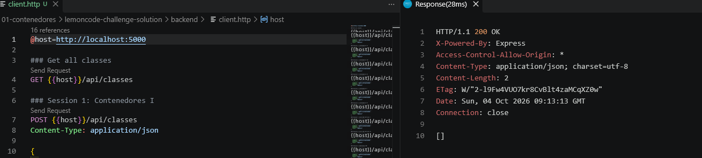

**POST**, crea una clase nueva (`201 Created`, Mongo le asigna el `_id`):

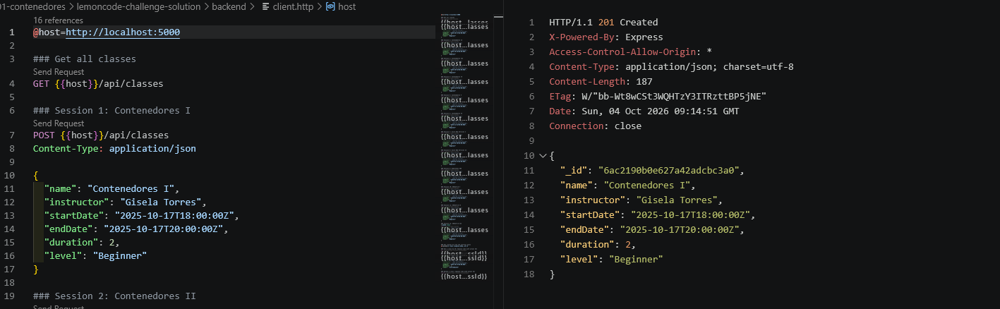

**GET por id**, usando el id que me devolvió el POST anterior (el `client.http` lo encadena solo con la petición que tiene `# @name class`):

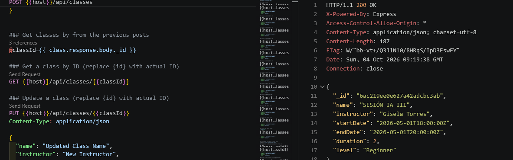

**PUT**, actualizo nombre/instructor/nivel:

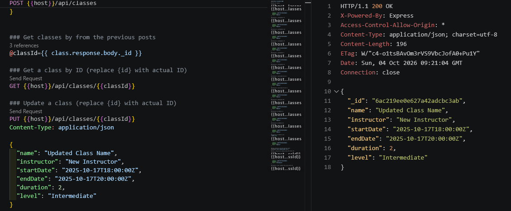

**DELETE**:

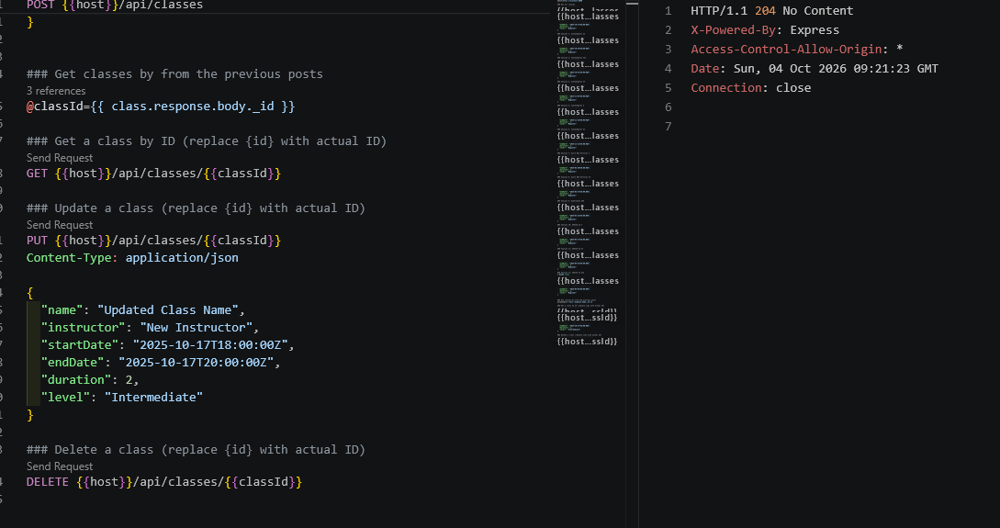

Y repetí el GET por id después de borrar, para comprobar que de verdad desaparece (`404`):

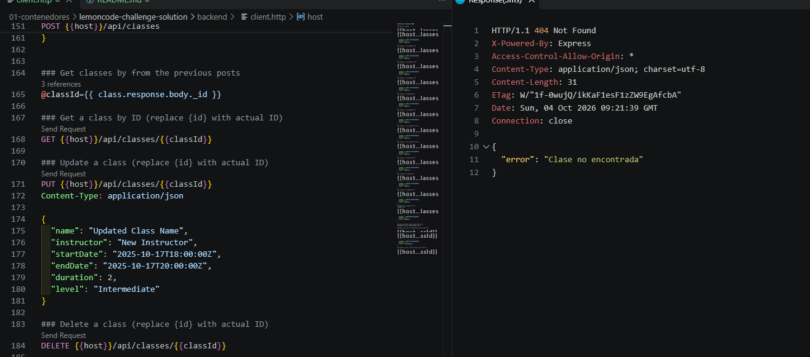

---

## 🐳 Reto 2: Dockerizar el Backend

### Dockerfile (`backend/Dockerfile`)

```dockerfile
FROM node:22

WORKDIR /app

COPY package*.json ./

RUN npm install

COPY . .

USER node

EXPOSE 5000

CMD ["node", "app.js"]
```

Cosas a tener en cuenta de este Dockerfile:
- Copio primero `package*.json` e instalo dependencias antes de copiar el resto del código. Así, si solo cambio algo de `app.js`, Docker no tiene que reinstalar todo de nuevo (reutiliza la capa cacheada del `npm install`).
- `USER node` para que el proceso no corra como root dentro del contenedor.
- `EXPOSE 5000` es solo informativo, no publica el puerto de verdad — eso lo sigue haciendo el `-p` del `docker run`.

`backend/.dockerignore`:
```
node_modules/
.env
client.http
```

### Build

```bash
docker build -t backend_custom .
```
(desde dentro de `backend/`)

### Run

```bash
docker run -d --network lemoncode-challenge --name backend_dockerfile \
  -p 5000:5000 \
  -e DATABASE_URL=mongodb://mongo_challenge:27017 \
  -e DATABASE_NAME=TopicsDb \
  -e HOST=0.0.0.0 \
  -e PORT=5000 \
  backend_custom
```

(Si lo copias/pegas y falla por el `\`, prueba a ponerlo todo en una sola línea — a veces se rompe la continuación por cosas raras del portapapeles).

Ya no hace falta montar el código como volumen ni instalar nada al vuelo: todo eso ya quedó "metido" dentro de la imagen cuando hice el build.

### Prueba del REST Client contra el backend dockerizado

GET, responde bien:

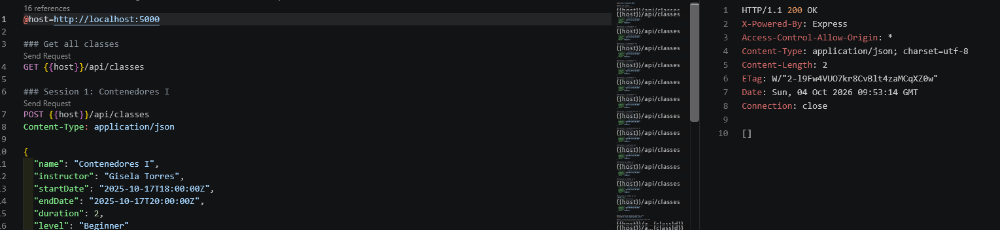

Al probar el POST me salió un error 500 la primera vez — resulta que había puesto `DATABASE_NAME=TopicsDB` (con B mayúscula) pero la base que ya existía desde el Reto 1 se llamaba `TopicsDb` (b minúscula), y Mongo no te deja tener dos bases que solo se diferencien en mayúsculas/minúsculas. En cuanto corregí la mayúscula, funcionó:

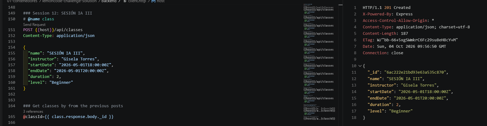

Y el PUT también responde bien:

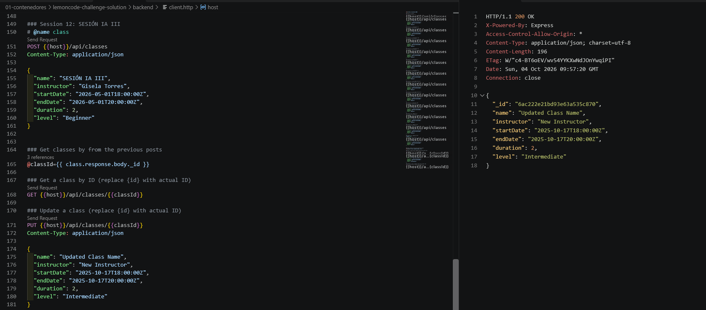

---

## 🎨 Reto 3: Dockerizar el Frontend

El README del reto pone como ejemplo conectar al backend en `http://topics-api:5000/api/classes`, pero yo llamé a mi contenedor `backend_dockerfile`, así que simplemente uso ese nombre en vez de `topics-api` — el nombre en sí no importa, lo que importa es que coincida con el hostname real del contenedor de backend dentro de la red.

### Dockerfile (`frontend/Dockerfile`)

```dockerfile
FROM node:22

WORKDIR /app

COPY package*.json ./

RUN npm install --omit=dev

COPY . .

USER node

EXPOSE 3000

CMD ["npm", "start"]
```

El `--omit=dev` instala solo lo que hace falta para correr la app (se salta `jest`, que solo es para tests, no para producción). Así la imagen pesa menos.

`frontend/.dockerignore`:
```
node_modules
.env-sample
```

Aquí metí la pata al principio: puse también `views/` en el `.dockerignore`, pensando que era algo que "no hacía falta copiar". Pero resulta que el servidor usa plantillas EJS (`res.render('index', ...)`) y necesita esa carpeta sí o sí dentro de la imagen para poder pintar la página — si la excluyes, el contenedor arranca pero la web falla al cargar. Lo quité y listo.

### Build y run

```bash
docker build -t frontend_custom .
```
(desde `frontend/`)

```bash
docker run -d --network lemoncode-challenge --name frontend_dockerfile \
  -p 3000:3000 \
  -e API_URL=http://backend_dockerfile:5000/api/classes \
  frontend_custom
```

### Variable de entorno

No usé un `.env` real para el frontend, se la paso directa al contenedor con `-e` en el `docker run` de arriba:

```
API_URL=http://backend_dockerfile:5000/api/classes
```

(Hay un `frontend/.env-sample` en el proyecto original como plantilla, pero no lo rellené porque no hacía falta un archivo si ya se la paso por flag).

### Comprobación

Entré a `http://localhost:3000` y vi la web cargando bien, con el backend conectado:

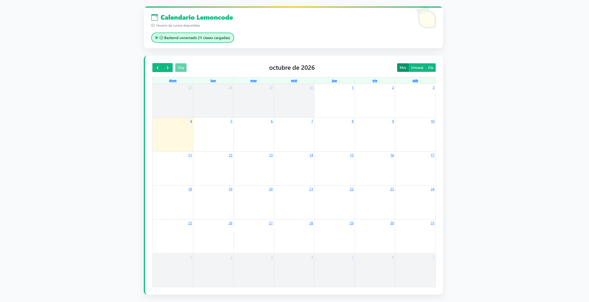

Al principio me asusté un poco porque decía "11 clases cargadas" pero no se veía ninguna en el calendario — pero es que el calendario abre siempre en el mes actual (octubre 2026), y las clases de prueba tienen fechas de otros meses (entre octubre 2025 y mayo 2026). Navegando con las flechas hasta febrero de 2026 ahí sí aparecen:

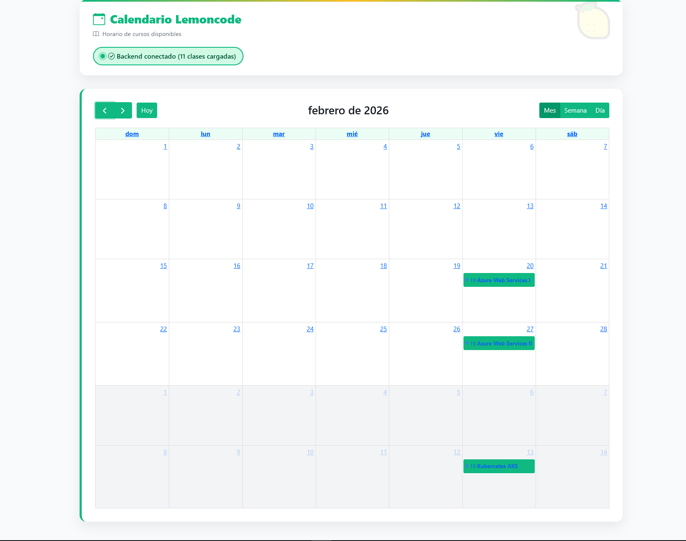

---

## 🎪 Reto 4: Docker Compose - Todo Junto

### `compose.yaml` (en la raíz de esta carpeta)

```yaml
services:

  # Base de datos. Volumen nuevo (db_data), independiente del que usamos
  # a mano en los Retos 1 y 2 (mongo-data) - empieza vacía.
  db:
    image: mongo:7.0
    volumes:
      - db_data:/data/db
    ports:
      - "27017:27017"
    restart: always
    networks:
      - lemoncode-network

  # Backend (imagen ya construida en el Reto 2 con `docker build -t backend_custom .`).
  # Se conecta a Mongo usando "db" como host, que es el nombre de servicio de arriba
  # (NO el nombre del contenedor manual "mongo_challenge" que usamos antes).
  backend:
    depends_on:
      - db
    image: backend_custom
    ports:
      - "5000:5000"
    restart: always
    environment:
      - DATABASE_URL=mongodb://db:27017
      - DATABASE_NAME=TopicsDB
      - HOST=0.0.0.0
      - PORT=5000
    networks:
      - lemoncode-network

  # Frontend (imagen construida en el Reto 3 con `docker build -t frontend_custom .`).
  # Igual que con Mongo, apunta al backend por el nombre de servicio ("backend"),
  # no por el nombre del contenedor manual "backend_dockerfile".
  frontend:
    depends_on:
      - backend
    image: frontend_custom
    ports:
      - "3000:3000"
    restart: always
    environment:
      - API_URL=http://backend:5000/api/classes
    networks:
      - lemoncode-network

volumes:
  db_data:

networks:
  lemoncode-network:
```

Sobre lo de un `.env` para Compose: no hice uno, porque las variables ya están puestas directamente en el `environment:` de cada servicio dentro del propio `compose.yaml` — con tan pocas variables y sin nada sensible de verdad, meter un `.env` aparte solo habría sido una capa extra sin necesidad real.

Cosas que aprendí haciendo esto:
- Al principio puse como host `mongo_challenge` y `backend_dockerfile` en las variables de entorno, copiando los nombres de los contenedores que había creado a mano en los retos anteriores. No funcionaba, porque en Compose cada servicio se llama a sí mismo por el nombre que le pones aquí (`db`, `backend`), no por como se llamara un contenedor suelto de antes.
- El volumen `db_data` es nuevo, no tiene nada que ver con el `mongo-data` de los retos anteriores — así que al levantar esto por primera vez, Mongo está vacío otra vez.
- Las dependencias entre servicios se definen con `depends_on`: puse `frontend` dependiendo de `backend`, y `backend` dependiendo de `db`, para que arranquen en orden.
- Antes de hacer `docker compose up` tuve que parar los contenedores sueltos de los retos anteriores (`mongo_challenge`, `backend_dockerfile`, `frontend_dockerfile`), porque si no los puertos 3000/5000/27017 ya estaban ocupados y Compose no podía arrancar.

### Levantar todo

```bash
docker compose up -d
```

### Comprobar que todo está arriba

```bash
docker compose ps
```

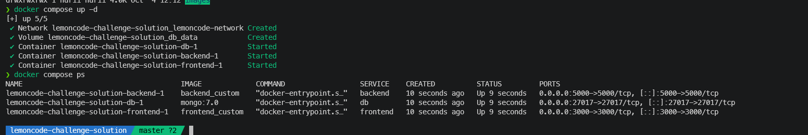

### La app funcionando en `http://localhost:3000`

Como el volumen de Mongo es nuevo, al entrar la primera vez no había ninguna clase. Hice un POST de prueba desde `client.http` (sigue apuntando a `localhost:5000`, que es el mismo puerto de siempre) para comprobar que todo el flujo completo funciona:

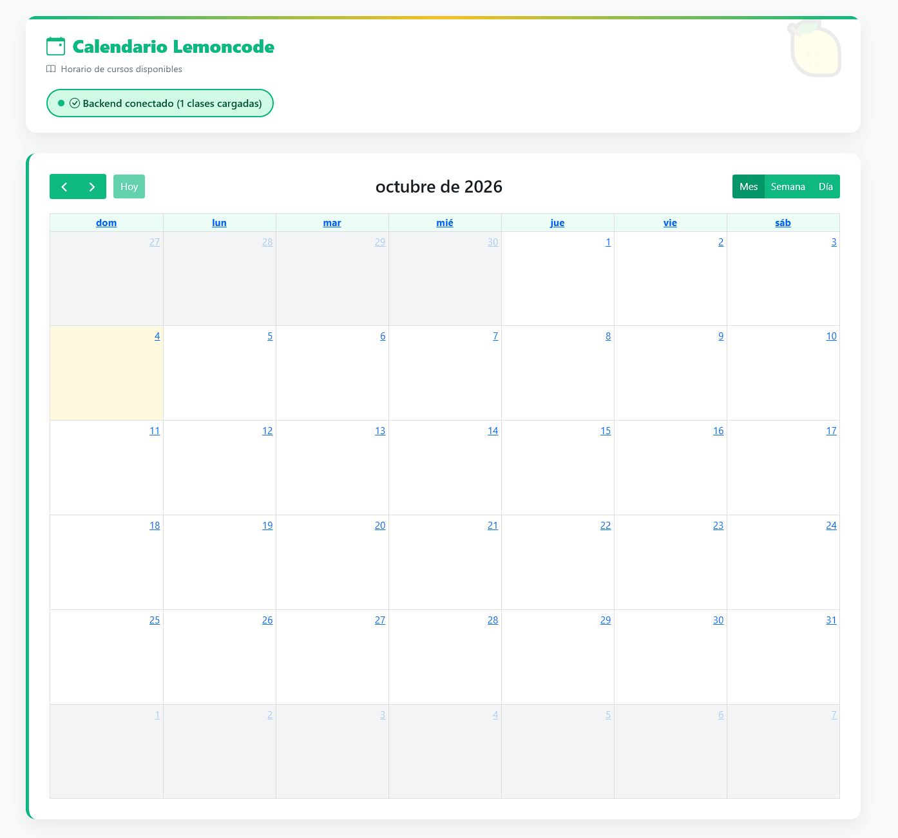

Y hasta la interactividad del calendario funciona bien — al hacer clic en una clase se abre el panel con los detalles:

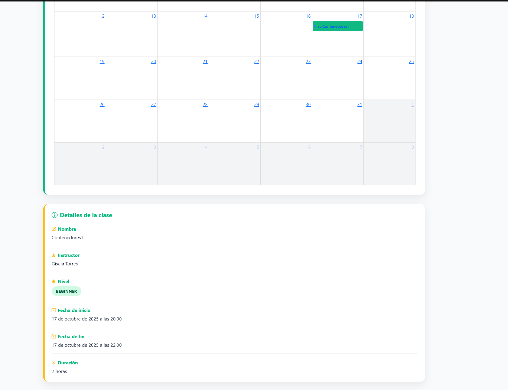

### Comandos que me van a servir para el día a día

```bash
docker compose up -d       # levantar todo en segundo plano
docker compose ps          # ver qué está arriba
docker compose logs -f     # logs en tiempo real de todos los servicios
docker compose down        # parar y borrar contenedores + red (el volumen se queda)
docker compose down -v     # igual, pero borrando también el volumen (se pierden los datos de Mongo)
```
